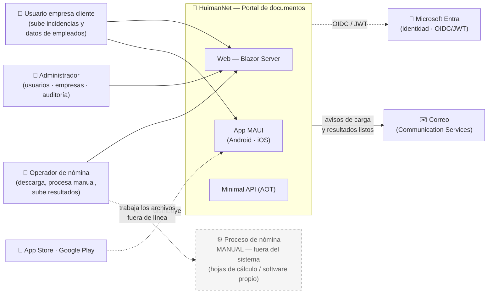
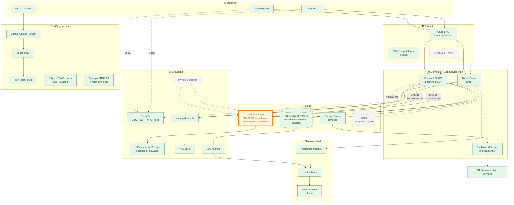
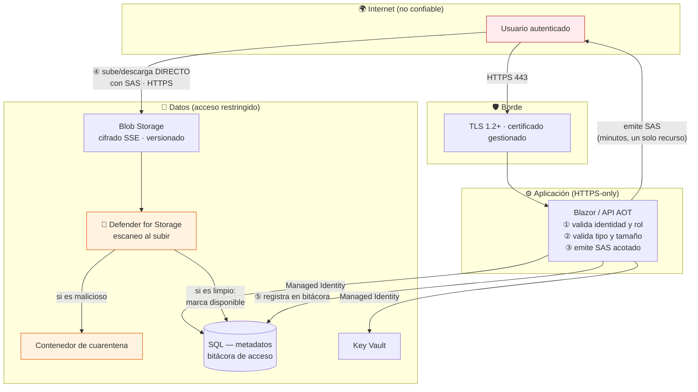
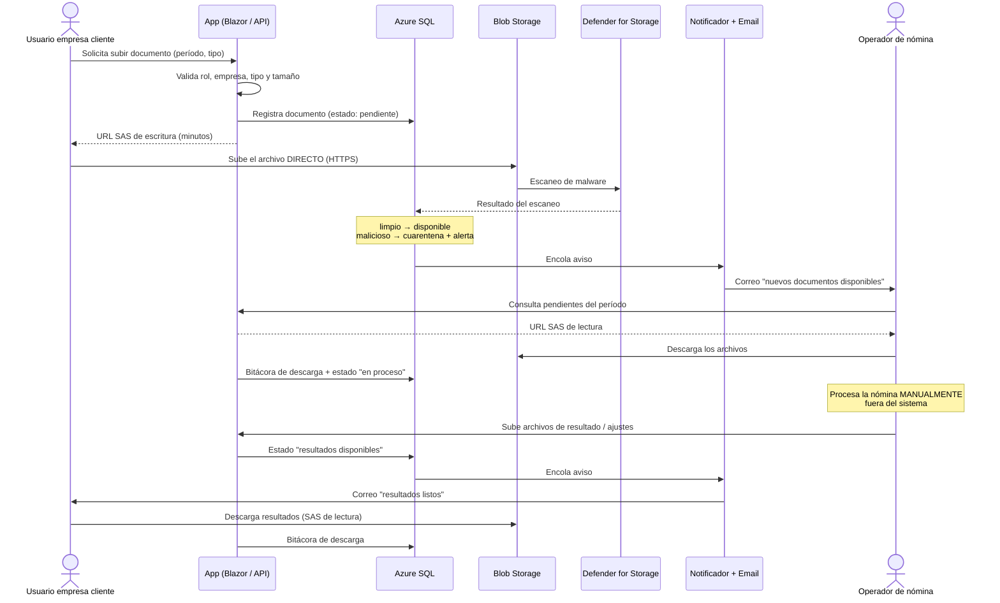

# HuimanNet.App — Arquitectura de Solución (Azure)

> Arquitectura del sistema **HuimanNet**, desplegado en **Microsoft Azure**.
>
> **V1 = Portal de intercambio de documentos de nómina.** Dimensionado para ≤ 500 usuarios sin sobrecostos, con ruta de crecimiento hacia 9000+ usuarios y hacia funcionalidad de cálculo en versiones futuras.

Complementa a [ESPECIFICACION.md](ESPECIFICACION.md).

---

## 1. Alcance de la V1

### 1.1 Qué hace el sistema

Es un **portal seguro de intercambio de archivos** entre las empresas cliente y la empresa que opera la nómina. El procesamiento de nómina es **manual, fuera del sistema**.

```
Empresa cliente                    HuimanNet                    Operador de nómina
      │                                │                                │
      │  1. Sube incidencias y         │                                │
      │     datos de empleados     ──► │ ──► notifica ──►               │
      │                                │                                │
      │                                │        2. Descarga y procesa   │
      │                                │           MANUALMENTE (fuera   │
      │                                │           del sistema)         │
      │                                │                                │
      │                                │ ◄── 3. Sube archivos de ◄──    │
      │                                │        resultado / ajustes     │
      │  4. Descarga resultados   ◄──  │                                │
      │                                │                                │
```

### 1.2 Dentro del alcance (V1)

| # | Capacidad |
|---|-----------|
| 1 | **Carga de documentos** por parte de usuarios de empresas cliente (incidencias, datos de empleados). |
| 2 | **Organización por período** y por tipo de documento. |
| 3 | **Descarga** por parte del operador de nómina de lo que suben los clientes. |
| 4 | **Carga de archivos de resultado/ajustes** por el operador. |
| 5 | **Descarga de resultados** por el usuario de la empresa cliente. |
| 6 | **Estado del ciclo** (recibido · en proceso · resultados disponibles). |
| 7 | **Notificación por correo** ante nuevas cargas y resultados listos. |
| 8 | **Autenticación, autorización por rol y aislamiento entre empresas.** |
| 9 | **Bitácora de auditoría** (quién subió/descargó qué y cuándo). |
| 10 | **Mismas capacidades en web (Blazor) y móvil (MAUI).** |

### 1.3 Fuera del alcance (V1) — decisión explícita

| Elemento | Estado |
|----------|--------|
| ❌ Motor de cálculo de nómina | El cálculo es **manual y externo**. |
| ❌ Integración bancaria (dispersión de pagos) | No aplica en V1. |
| ❌ Integración fiscal / seguridad social | No aplica en V1. |
| ❌ Generación automática de recibos PDF | Los archivos de resultado los **produce el operador** y los sube. |
| ❌ Reglas impositivas / motor tributario | Fuera del sistema. |
| ❌ Worker de procesamiento masivo | No hay procesamiento pesado que orquestar. |

> **Implicación clave**: el dominio de V1 es **gestión documental + flujo de estados**, no cálculo. Esto simplifica el modelo, reduce infraestructura y traslada la exigencia técnica hacia **seguridad de archivos, control de acceso y trazabilidad**.

---

## 2. Principio de diseño: empezar pequeño, escalar sin rediseño

Con ≤ 500 usuarios y un sistema esencialmente de **CRUD + almacenamiento de archivos**, la mayoría de los servicios "enterprise" de Azure serían coste sin retorno. Cada recurso añadido es coste fijo, superficie de configuración y una pieza más que puede fallar.

**Regla aplicada**: incluir sólo lo que aporta valor a esta escala, y documentar el **disparador exacto** de cada servicio diferido. Nada "por si acaso" — con una excepción deliberada: **la seguridad de los archivos subidos no se difiere** (§6).

### Por qué esta arquitectura escala sin rediseño

| Decisión tomada hoy | Qué habilita mañana |
|---------------------|---------------------|
| **API stateless (AOT) + JWT** | Escalar horizontalmente sin sesión pegajosa. |
| **Clean Architecture** (lógica en `Application`/`Domain`) | Añadir el **motor de cálculo en V2** como nuevos casos de uso, sin tocar la capa de documentos. |
| **Blob Storage como núcleo** | Escala virtualmente ilimitada desde el día 1; no cambia nada al crecer. |
| **Carga/descarga directa a Blob con SAS** | El servidor nunca es cuello de botella de ancho de banda, sin importar el volumen. |
| **Azure SQL** | Subir de serverless a provisionado o añadir réplicas **sin migración**. |
| **Managed Identity + Key Vault** | El modelo de seguridad no cambia con la escala. |
| **IaC con Bicep** | Escalar = cambiar parámetros y redesplegar. |

---

## 3. Diagramas de arquitectura (conjunto de vistas)

| Vista | Pregunta que responde |
|-------|------------------------|
| **3.1 Contexto** (C4-N1) | ¿Quién usa el sistema y con qué se integra? |
| **3.2 Servicios Azure** | ¿Qué componentes lo forman y en qué fase entra cada uno? |
| **3.3 Zonas de confianza** | ¿Qué fronteras de seguridad cruzan los archivos? |
| **3.4 Vista dinámica** | ¿Cómo fluye un ciclo completo de intercambio? |

### 3.1 Vista de contexto — C4 Nivel 1



> **Sin integraciones externas de negocio en V1.** Banca y autoridad fiscal quedan fuera (§1.3); entrarían con el motor de cálculo en V2+.

### 3.2 Vista de servicios Azure

Nodos **verdes = Fase 1** (día 1). **Grises punteados = diferidos** a Fase 2/3 (§8).



| Leyenda | Significado |
|---------|-------------|
| 🟠 Naranja | **Núcleo del sistema** — Blob Storage es el corazón de la V1. |
| 🟢 Verde | **Fase 1** — se aprovisiona el día 1 (≤500 usuarios). |
| ⬜ Gris punteado | **Fase 2/3** — diseñado, se activa con señal de carga (§8). |

### 3.3 Zonas de confianza y ruta del archivo

El archivo es el activo sensible. **Nunca atraviesa el servidor de aplicación**: sube y baja directo a Blob con URL SAS de corta duración emitida tras validar permisos.



**Principios de las fronteras:**
- **Z0 → Z1**: sólo HTTPS 443.
- **Z1 → Z2**: HTTPS-only; la API exige JWT válido con el rol correcto en cada petición.
- **Z2 → Z3**: exclusivamente por **Managed Identity** — no hay contraseñas que robar.
- **Usuario → Blob**: sólo con **SAS de minutos, alcance de un único blob y permiso mínimo** (escritura para subir, lectura para descargar). Sin SAS, el contenedor es inaccesible.
- **Archivo subido = no confiable hasta escanearse**: queda marcado como *pendiente* y no es descargable hasta que Defender lo declare limpio.

### 3.4 Vista dinámica — ciclo completo de intercambio



### Nota sobre herramientas de diagramado

Los diagramas están en **Mermaid** (versionables, renderizan en GitHub/Azure DevOps; fuentes en [diagramas/](diagramas/)). Para entregas ejecutivas, importar en **draw.io** (*Arrange → Insert → Advanced → Mermaid*) y aplicar la librería de **iconos oficiales de Azure**. Mermaid es la fuente de verdad; draw.io la vista de presentación.

---

## 4. Análisis: qué incluir y qué diferir

### 4.1 Esencial desde el día 1

| Componente | Servicio Azure | ¿Por qué es esencial? | Coste |
|-----------|----------------|------------------------|-------|
| Web + API | **App Service Plan B1/B2** (2 apps, 1 plan) | Alojar Blazor y la API. Plan compartido = lo más barato. | Bajo, fijo |
| **Archivos (núcleo)** | **Blob Storage** (Hot LRS, versionado, soft delete) | **Es el corazón del sistema.** Barato y escala sin límite. | Muy bajo |
| **Escaneo de malware** | **Defender for Storage** | Usuarios externos suben archivos arbitrarios. **No es opcional en un portal de carga.** | Bajo (~10 USD/mes por cuenta + por GB) |
| Metadatos y estados | **Azure SQL Serverless** | Documentos, períodos, estados, usuarios, bitácora. Auto-pause. | Bajo/variable |
| Identidad | **Microsoft Entra** | Autenticación + **roles** (cliente / operador / admin) + aislamiento entre empresas. | Bajo/incluido |
| Secretos | **Key Vault** | Claves y cadenas de conexión. Nunca en `appsettings`. | Muy bajo |
| Identidad de servicio | **Managed Identity** | Acceso a SQL/Blob/KV sin secretos. | Gratis |
| TLS | **App Service Managed Certificate** | HTTPS en dominio propio, renovación automática. | Gratis |
| Observabilidad | **App Insights + Log Analytics** | Sin telemetría se opera a ciegas. | Muy bajo |
| Alertas | **Azure Monitor** | Errores, latencia, malware detectado, presupuesto. | Incluido |
| Notificaciones | **Communication Services (Email)** | Avisos de carga y de resultados listos. | Muy bajo |
| Cola de avisos | **Storage Queue** | Desacopla el envío de correo de la petición web. | Marginal |
| Auditoría | **SQL Auditing → Log Analytics** | Trazabilidad de acceso a datos laborales. | Muy bajo |
| Entornos | **Resource Groups** dev/test/prod | Aislamiento por entorno. | Gratis |
| CI/CD | **GitHub Actions** | Build, test, publish AOT, deploy. | Gratis/bajo |
| IaC | **Bicep** | Despliegue reproducible sin estado remoto. | Gratis |
| Gobierno | **Policy · RBAC · Locks · Tags · Budgets** | Cumplimiento y control de gasto. | Gratis |
| Respaldos | **SQL PITR/LTR + versionado Blob** | Recuperación y **retención legal** de documentos. | Incluido |

### 4.2 Diferido — con disparador explícito

| Componente | Por qué **NO** ahora | Disparador |
|-----------|----------------------|-----------|
| **Redis** | Con 1 instancia de Blazor no hace falta backplane; ≤500 usuarios caben de sobra. | Blazor escala a **> 1 instancia**. |
| **Service Bus** | Los avisos por correo son de bajísimo volumen. | Necesidad de temas/suscripciones, sesiones o DLQ avanzado. |
| **Worker dedicado** | **No hay procesamiento pesado en V1** (el cálculo es manual y externo). | Llega el **motor de cálculo (V2)** o generación masiva de archivos. |
| **Container Apps + ACR** | La API AOT corre bien como app self-contained en el plan existente. | Necesidad de escala a cero agresiva o despliegue independiente. |
| **Front Door + WAF** | Coste fijo relevante; el acceso ya exige autenticación Entra. | Exposición pública con tráfico real o requisito de cumplimiento. |
| **Private Endpoints + VNet** | Coste por endpoint y gestión de red. Los firewalls de servicio cubren el riesgo a esta escala. | Política de cumplimiento que exija aislamiento de red. |
| **App Configuration** | Pocos servicios; añade dependencia. | Muchos servicios compartiendo configuración. |
| **Terraform** | Estado remoto y tooling excesivo para un entorno 100% Azure. | Multi-nube o equipo grande con módulos complejos. |

### 4.3 Las capas de "firewall", con costos reales

"Firewall" en Azure son cuatro cosas distintas:

| Capa | Producto | Protege de | Costo | ¿Cuándo? |
|------|----------|------------|-------|----------|
| **Aplicación (L7)** | **WAF** (Front Door) | OWASP Top 10, bots, rate limiting | Fijo relevante | Fase 2/3 |
| **Red (L3/L4)** | **Azure Firewall** | Tráfico de red en VNet hub-spoke | **Alto** (cientos USD/mes) | **Probablemente nunca**: arquitectura 100% PaaS, sin VMs. Documentado para que sea decisión explícita. |
| **Servicio** | Firewall de **SQL / Storage / Key Vault** | Orígenes no autorizados a cada recurso | **Gratis** | **Día 1** |
| **DDoS** | **DDoS de plataforma** | Ataques volumétricos | **Incluida** | Siempre activa |

---

## 5. Infraestructura a aprovisionar (V1)

```
Suscripción Azure
│
├── rg-huimannet-dev      (réplica reducida)
├── rg-huimannet-test     (validación pre-producción)
└── rg-huimannet-prod     (Resource Lock: CanNotDelete)
    │
    ├── App Service Plan (B1/B2, Linux)
    │   ├── App Service  →  Web Blazor Server
    │   └── App Service  →  Minimal API (AOT, self-contained)
    │
    ├── ★ Storage Account (NÚCLEO)
    │   ├── Blob: contenedores por empresa/período (Hot LRS)
    │   ├── Versionado + soft delete + política de retención legal
    │   ├── Defender for Storage (escaneo de malware)
    │   ├── Contenedor de cuarentena
    │   ├── Storage Queue (avisos de correo)
    │   └── Firewall de servicio
    │
    ├── Azure SQL Database (Serverless, General Purpose)
    │   ├── Metadatos: empresas · usuarios · documentos · estados · bitácora
    │   ├── SQL Auditing → Log Analytics
    │   ├── Firewall de servicio
    │   └── Backups PITR + retención LTR
    │
    ├── Microsoft Entra (app registrations · JWT · MFA · roles)
    ├── Azure Key Vault (secretos vía Managed Identity)
    │
    ├── Application Insights + Log Analytics Workspace
    ├── Azure Monitor (alertas: errores, malware, latencia, presupuesto)
    ├── Azure Communication Services (Email)
    │
    ├── Azure DNS + App Service Managed Certificate (TLS gratuito)
    └── Protección DDoS de plataforma (incluida)

Transversal a la suscripción (gratuito):
├── Azure Policy (TLS 1.2+, HTTPS-only, tags obligatorios)
├── RBAC de privilegio mínimo por entorno
├── Defender for Cloud — CSPM gratuito
├── Cost Management + Budgets
├── Tags de gobierno (entorno · propietario · centro de costo)
└── (IaC) Bicep + GitHub Actions (CI/CD por entorno)
```

**La huella de pago es mínima**: plan B1/B2, SQL serverless, storage, Defender for Storage y correo. Todo el gobierno (Policy, RBAC, locks, tags, budgets, auditoría, CSPM) es **gratuito**. Nivel empresarial no significa caro: significa que nada queda sin gobernar, auditar ni respaldar.

---

## 6. Seguridad — el foco real de esta V1

En un portal donde **usuarios externos suben archivos** que contienen **datos laborales y personales**, el riesgo se concentra en tres frentes. Ninguno se difiere:

### 6.1 Seguridad de los archivos subidos

- **Escaneo de malware** (Defender for Storage) en cada carga. Archivo **no descargable hasta declararse limpio**; si es malicioso → cuarentena + alerta.
- **Validación en la aplicación**: lista blanca de extensiones/MIME permitidos y **límite de tamaño** antes de emitir el SAS.
- **Nunca ejecutar ni interpretar** el contenido subido; se almacena y se sirve como descarga.
- **Nombres de blob generados por el sistema** (GUID), nunca el nombre original del usuario → evita *path traversal* y colisiones.

### 6.2 Control de acceso y aislamiento

- **Aislamiento entre empresas**: toda consulta filtra por la empresa del token. Una empresa **no puede ver documentos de otra** — es el riesgo #1 en un portal multiempresa.
- **Roles**: usuario cliente · operador de nómina · administrador, con permisos distintos por operación.
- **SAS de mínimo privilegio**: minutos de vigencia, un solo blob, permiso único (lectura *o* escritura). El contenedor nunca es público.
- **Autorización verificada en el servidor** antes de emitir cualquier SAS — jamás confiando en el cliente.

### 6.3 Trazabilidad y cumplimiento

- **Bitácora de acceso**: quién subió/descargó qué documento y cuándo. En datos de nómina, saber **quién descargó** es tan importante como quién subió.
- **SQL Auditing → Log Analytics**, con retención acorde a la norma local.
- **Versionado + soft delete** en Blob: nada se pierde por error humano.
- **Política de retención legal** de documentos laborales (definir años según país).

### 6.4 Plataforma

- **Managed Identity** → cero secretos en cadenas de conexión.
- **Key Vault** para secretos y claves, rotables.
- **TLS 1.2+** extremo a extremo con certificado gestionado gratuito.
- **Entra** con JWT de vida corta + **MFA** para operadores y administradores.
- **Firewalls de servicio** en SQL y Storage.
- **Cifrado en reposo** (TDE, SSE) y en tránsito, por defecto.
- **Azure Policy** y **Resource Locks** en producción.
- **CI/CD con credenciales federadas OIDC** (GitHub ↔ Entra), sin secretos almacenados.

---

## 7. Decisiones abiertas

| # | Decisión | Impacto | Opciones |
|---|----------|---------|----------|
| 1 | **Modelo de identidad** | Alto — define registro y gestión de usuarios | **Entra External ID** (usuarios de empresas cliente externas, autoservicio) vs **Entra ID** (si todos los usuarios pertenecen a la organización). Dado que hay empresas cliente externas, **External ID es lo más probable**. |
| 2 | **¿Multiempresa?** | Alto — define el modelo de datos y el aislamiento | ¿El operador atiende a varias empresas cliente en la misma instancia? Determina particionamiento de contenedores y filtrado obligatorio. |
| 3 | **Retención legal de documentos** | Medio — define política de Blob y costos | Años de retención según normativa laboral del país. |
| 4 | **Tipos y tamaño máximo de archivo** | Medio — define validación y límites | Excel/CSV/PDF típicamente; definir tope por archivo. |
| 5 | **País de operación** | Bajo en V1, **alto en V2** | Sin integraciones fiscales en V1, pero condiciona retención y el futuro motor de cálculo. |

---

## 8. Ruta de crecimiento

Escalado guiado por **señales en Application Insights**, no por calendario.

### Fase 1 — V1 Portal de documentos (0 – 500 usuarios) · *este documento*

App Service B1/B2 (1 instancia) · SQL serverless con auto-pause · Blob como núcleo · avisos con BackgroundService.

### Fase 2 — Crecimiento (500 – 3000 usuarios)

| Señal | Acción |
|-------|--------|
| CPU/memoria sostenida > 70% | Subir plan a **S1/P0v3** y/o separar la API. |
| Blazor necesita > 1 instancia | Añadir **Redis** (backplane SignalR) — primer disparador típico. |
| Volumen de archivos elevado | Revisar **niveles de acceso** (Cool/Archive para documentos antiguos) → ahorro real. |
| SQL con pausas molestas | Serverless sin auto-pause o provisionado pequeño. |

### Fase 3 — Escala objetivo (3000 – 9000+ usuarios)

| Señal | Acción |
|-------|--------|
| Tráfico público relevante | **Front Door + WAF** con CDN. |
| Varias instancias | Autoescalado por reglas; plan **P1v3+**. |
| SQL cuello de botella de lectura | Réplicas de lectura; revisar índices con Query Store. |
| Cumplimiento de red | **VNet + Private Endpoints** para SQL, Blob y Key Vault. |
| Mensajería avanzada | Storage Queues → **Service Bus**. |

### V2+ — Evolución funcional (más allá del portal)

Cuando el negocio decida **automatizar el procesamiento** hoy manual:

| Capacidad nueva | Infraestructura que requiere |
|-----------------|------------------------------|
| Motor de cálculo de nómina | Worker dedicado (**Functions** o Container Apps) + lógica en `Domain`. |
| Generación automática de recibos PDF | Worker + mayor uso de Blob. |
| Integración bancaria (dispersión) | Conectores seguros en `Infrastructure` + posible red privada. |
| Integración fiscal / seguridad social | Adaptadores país-específicos + retención probatoria. |

> **La Clean Architecture es lo que hace barata esta evolución**: el motor de cálculo entra como nuevos casos de uso en `Application`/`Domain`, reutilizando el portal de documentos ya construido.

---

## 9. Objetivos de servicio y continuidad (Fase 1)

| Métrica | Objetivo | Cómo se sustenta |
|---------|----------|-------------------|
| **Disponibilidad compuesta** | ~99.8% mensual (≈90 min/mes) | App Service 99.95% × Azure SQL 99.99% × Storage 99.9%+ |
| **RPO — metadatos SQL** | ≤ 10 minutos | Backups PITR (respaldo de log continuo) |
| **RTO — base de datos** | ≤ 2 horas | Restauración PITR |
| **RPO — documentos (Blob)** | ≈ 0 | Versionado + soft delete |
| **RTO — aplicación** | ≤ 1 hora | Redespliegue desde Bicep + CI/CD |
| **Retención de auditoría** | ≥ 1 año (ajustar a norma local) | SQL Auditing → Log Analytics + LTR |
| **Retención de documentos** | Según normativa laboral | Política de retención en Blob |
| **DR regional** | **No cubierto en Fase 1** (decisión de costo) | Fase 3: geo-réplica SQL + Blob GRS |

**Ventana de mantenimiento**: fuera de los períodos de carga de nómina (quincenas / fin de mes), cuando el portal concentra su uso.

> La ausencia de DR multi-región es una **decisión informada, no una omisión**: a ≤500 usuarios, el costo de una región secundaria no se justifica frente a un RTO de horas vía redespliegue IaC + PITR. Disparador de revisión en Fase 3.

---

*Documento vivo — la arquitectura arranca mínima, con la seguridad de los archivos como prioridad no negociable, y crece guiada por señales reales.*
